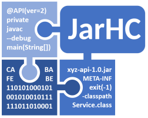

---
sources:
  - jarhc/src/main/java/org/jarhc/analyzer/AnalyzerRegistry.java
last_reviewed: 2026-06-25
---

# JarHC - JAR Health Check

JarHC is a static analysis tool to help you find your way through "JAR hell" a.k.a. "dependency hell" a.k.a. "classpath hell".

Its main purpose is to analyze a set of Java artifacts and check whether they are compatible at a binary level,
and whether they contain any "unpleasant surprises" for you.

JarHC can analyze the following Java artifacts:

* Maven coordinates: JarHC will download the JAR files from a Maven repository and analyze them.
* JAR files (*.jar): JarHC will analyze the contained Java classes, and also detect and analyze nested JAR files.
* WAR files (*.war): JarHC will extract the contained JAR files and analyze them.
* JMOD files (*.jmod): JarHC will analyze the contained Java classes.

## Motivation

A typical mid-size Java project uses dozens of third-party Java libraries.
Every library comes with its own set of direct and transitive dependencies.
This can lead to a situation where you have dependencies on different versions of the same library.
Finding a combination of library versions which work together can be a difficult task.

**Example**

You work on a project which uses [Apache Hadoop](https://hadoop.apache.org/) 3.4.0 and [Quartz](https://www.quartz-scheduler.org/) 2.5.0.
Both libraries depend on [SLF4J](http://www.slf4j.org/):

* [Hadoop 3.4.0](https://mvnrepository.com/artifact/org.apache.hadoop/hadoop-common/3.4.0) uses an older SLF4J version 1.7.36.
* [Quartz 2.5.0](https://mvnrepository.com/artifact/org.quartz-scheduler/quartz/2.5.0) uses a newer SLF4J version 2.0.16.

Best case, SLF4J 2.x is 100% backward-compatible to SLF4J 1.7.x, and you can simply use the newer SLF4J version 2.0.16 in your project.
But how can you be sure?

* You can read the SLF4J documentation and look for information about backward-compatibility.
* You can compare the public API of the two SLF4J versions and look for breaking changes.
* You can try to compile Hadoop 3.4.0 against the newer SLF4J version 2.0.16.
* You can write tests covering the Hadoop and Quartz components which use SLF4J.
* You can perform manual tests.

And last but not least:

* **You can use JarHC to analyze the binary compatibility between Hadoop 3.4.0 and SLF4J version 2.0.16.**

While binary compatibility alone does not guarantee functional compatibility, binary compatibility is usually a good indicator whether the libraries will work together as expected.
And if JarHC finds binary incompatibilities, you can take a closer look at the affected classes and methods.

**More information**

If you want to know more about the JAR hell, check out these articles:

* [What is JAR Hell?](https://dzone.com/articles/what-is-jar-hell) at DZone
* [JAR Hell](https://blog.codefx.org/java/jar-hell/) at CodeFX

## How JarHC works

The input to JarHC is a set of Java artifacts, called the "classpath".
This is usually a bunch of third-party libraries used in a Java project.
JarHC analyzes these artifacts and generates a report for various aspects.

## Report sections

* [JAR Files](reports/jar-files.md): Lists all artifacts on the classpath with their size, content, Java version, checksum, and Maven coordinates.
* [Vulnerabilities](reports/vulnerabilities.md): Lists known security vulnerabilities for the Java artifacts on the classpath.
* [Dependencies](reports/dependencies.md): Shows the dependencies between artifacts based on actual class usage, their declared Maven dependencies and whether these are satisfied, and available updates.
* [Duplicate Classes](reports/duplicate-classes.md): Lists Java classes and resources that occur more than once on the classpath, including classes that shadow the Java runtime, and reports how similar the duplicates are.
* [Binary Compatibility](reports/binary-compatibility.md): Validates every Java class on the classpath and checks whether it is binary-compatible with other Java classes it depends on, and reports missing or inaccessible classes, methods, and fields.
* [Blacklist](reports/blacklist.md): Reports usage of dangerous, unsafe, unstable, or deprecated classes, methods, and fields, and executable files bundled as resources.
* [JAR Manifests](reports/jar-manifests.md): Lists information found in MANIFEST.MF files of the Java artifacts on the classpath.
* [JPMS Modules](reports/jpms-modules.md): Lists the Java module of each artifact, including explicit, automatic, and auto-generated modules.
* [OSGi Bundles](reports/osgi-bundles.md): Lists information about OSGi Bundles found on the classpath.
* [Java Runtime](reports/java-runtime.md): Lists information about the Java Runtime (JRE or JDK) used to run JarHC.
