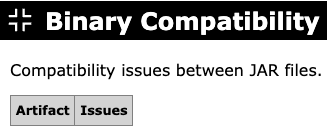

---
sources:
  - jarhc/src/main/java/org/jarhc/analyzer/BinaryCompatibilityAnalyzer.java
last_reviewed: 2026-06-25
---

# Binary Compatibility

Checks whether the compiled code on the classpath is binary compatible, that is,
whether every class, method, and field referenced by a class is actually present,
accessible, and compatible. Only artifacts with at least one issue are listed,
with one row per artifact.

The table contains the following columns:

**Artifact**

The name of the artifact that contains the issues.

**Issues**

The binary compatibility issues found in the artifact. Issues are grouped by the
class in which they occur, or by the manifest attribute they relate to, with each
individual problem listed below. The following kinds of issues are reported:

* Missing classes, methods, or fields that are referenced but cannot be found on
  the classpath. When a class is missing, the report also indicates whether its
  package was found.
* Inaccessible classes, methods, or fields, including illegal access across
  packages or modules, and classes that are not exported by their module.
* Class hierarchy problems, such as a superclass or interface that cannot be
  found, a final superclass, an interface that is actually a class, or a violated
  sealed class constraint.
* Abstract methods that are not implemented by a concrete class.
* Incompatible member usage, such as static access to an instance member or the
  reverse, an incompatible field type, or write access to a final field.
* Annotation problems, such as a missing annotation type or a class used as an
  annotation that is not one.
* Class files compiled for a newer Java version than the multi-release folder
  they are bundled in.
* Manifest problems, such as a `Main-Class` that does not exist or has no valid
  main method, or a `Class-Path` entry that cannot be found or is not a JAR file.

**Example**

{target="_blank" rel="noopener"}

Next: [Blacklist](blacklist.md)
