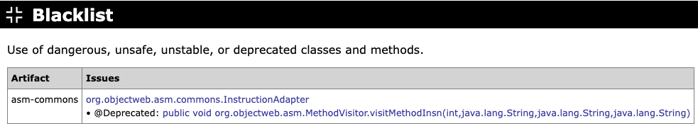

# Blacklist

Reports the use of dangerous, unsafe, unstable, or deprecated classes, methods,
and fields, as well as executable files bundled as resources. Only artifacts with
at least one issue are listed, with one row per artifact.

The table contains the following columns:

**Artifact**

The name of the artifact that contains the issues.

**Issues**

The blacklisted references and resources found in the artifact. References are
grouped by the class in which they occur, with each match listed below it.
Executable resources are listed directly by their path. The following items are
flagged:

* Use of `sun.misc.Unsafe`.
* Stopping the JVM: `System.exit`, `Runtime.exit`, or `Runtime.halt`.
* Loading native libraries: `System.load`, `System.loadLibrary`, `Runtime.load`,
  or `Runtime.loadLibrary`.
* Executing system commands: `Runtime.exec`.
* Use of the deprecated `com.sun.image.codec.jpeg` API, which was removed in
  Java 9.
* Elements marked with an annotation for an unstable or deprecated API:
  `@Deprecated`, `@VisibleForTesting`, `@Beta`, or `@DoNotCall`. These are
  reported only when the annotated element is defined in a different artifact.
* Executable files bundled as resources: `*.dll`, `*.exe`, `*.so`, `*.bat`, or
  `*.sh`.

**Example**

{target="_blank" rel="noopener"}

Next: [JAR Manifests](jar-manifests.md)
