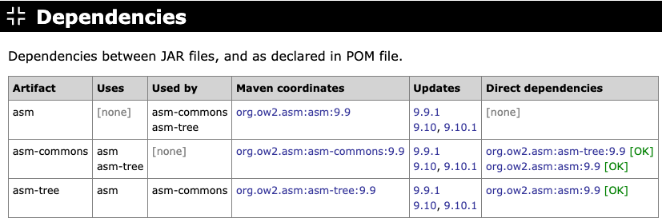

# Dependencies

Lists direct dependencies as declared in POM files and analyzes whether these dependencies are satisfied (available on the classpath).

> **TODO** Update description.  
> Lists dependencies between JAR files ("uses" and "used by"). This report is based on actual usage of classes, methods and fields in Java code.

{target="_blank" rel="noopener"}

Next: [Duplicate Classes](duplicate-classes.md)
