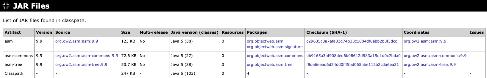

# JAR Files

List of JAR files found in classpath with the following information:

> **TODO** Update description.  
> Java versions for which the Java classes in the JAR files have been compiled. This allows you to find the "minimum Java version" required to run all classes.
>List of packages per JAR file.
>Checks for split packages: packages found in multiple JAR files.
>Checks for "fat JARs": JARs with a mix of very different packages, potentially because multiple JAR files have been merged.

* File size
* Number of Java classes in JAR file
* Number of Resources in JAR file
* Is JAR file a multi-release JAR?
* Is JAR file a JPMS module? If yes, what is the module name?
* SHA-1 checksum
* Maven artifact coordinates (if checksum is found on Maven Central)

{target="_blank" rel="noopener"}

Next: [Dependencies](dependencies.md)
