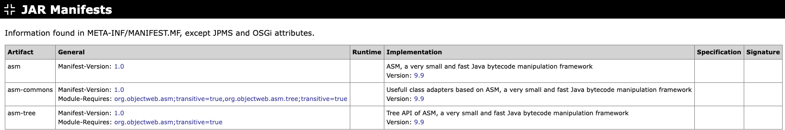

# JAR Manifests

Shows the information found in the `META-INF/MANIFEST.MF` file of each artifact,
grouped into categories. There is one row per artifact that has a manifest.
Attributes that belong to JPMS modules or OSGi bundles, and attributes that are
shown in other sections (such as `Multi-Release` and `Automatic-Module-Name` in
the JAR Files section), are not repeated here.

The table contains the following columns:

**Artifact**

The name of the artifact.

**General**

All manifest attributes that are not covered by the other columns and that do not
belong to JPMS modules or OSGi bundles. Each attribute is shown as `name: value`,
sorted alphabetically.

**Runtime**

The runtime-related manifest attributes: `Main Class` (from the `Main-Class`
attribute) and `Class Path` (from the `Class-Path` attribute).

**Implementation**

The implementation-related manifest attributes: the implementation title,
followed by its version, build, build ID, vendor, vendor ID, and URL where
present.

**Specification**

The specification-related manifest attributes: the specification title, followed
by its version and vendor where present.

**Signature**

Information about the JAR file's digital signature. This column is reserved for
future use and is currently empty.

**Example**

{target="_blank" rel="noopener"}

Next: [JPMS Modules](jpms-modules.md)
