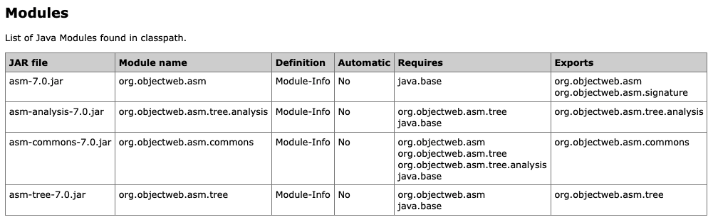

# JPMS Modules

Extract JPMS module information from all JAR files from `module-info.class` files. If there is no such information, look for a JAR manifest attribute "Automatic-Module-Name". Otherwise, auto-generate module name based on file name.

Next: [OSGi Bundles](osgi-bundles.md)
