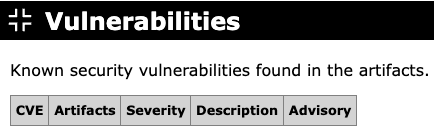

# Vulnerabilities

Reports known security vulnerabilities for the artifacts on the classpath, one
row per vulnerability. For every artifact that can be identified by its Maven
coordinates, JarHC looks up known security advisories from a public vulnerability
database. Artifacts that cannot be identified are skipped.

The table contains the following columns:

**CVE**

The CVE identifier or identifiers of the vulnerability, each linked to the
corresponding [NVD](https://nvd.nist.gov) detail page. For advisories that have
not yet been assigned a CVE, this column shows `[unknown]`, and the advisory
identifier (for example, a GHSA ID) is found in the **Advisory** column instead.

**Artifacts**

All artifacts on the classpath that are affected by the vulnerability, one per
line.

**Severity**

The CVSS v3 base score and its qualitative rating (Critical, High, Medium, Low,
or None), for example `8.8 High`. Advisories that have not yet been scored are
shown as `[unknown]`.

**Description**

A short description of the vulnerability, taken from the advisory title. Longer
descriptions are truncated to 128 characters and end with a `[...]` marker.

**Advisory**

A link to the advisory with further details. If the vulnerability has additional
identifiers that are not CVEs, such as secondary GHSA IDs, they are listed below
the link.

Vulnerabilities are sorted by CVE: advisories without a CVE appear first,
followed by the remaining advisories sorted by year and number, newest first.

**Example**

{target="_blank" rel="noopener"}

Next: [Dependencies](dependencies.md)
